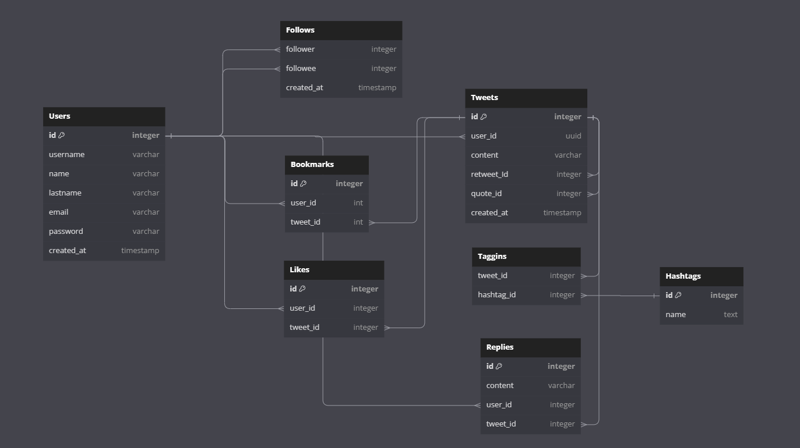

# README

Explanation of database schema:

This tweeter database es composed by several entities:

user: 
user which is the main entity can publish many tweets. One-to-many relationship
User have a relationship of one many tweets, because one user can publish many tweets.
a User can make many replies.
a User can like many tweets.
a User can bookmark many tweets.

Follows:
It's a table that groups the follower and the followee.
So this table identifies who is been followed by a followee and contains
a User can have many followers.
a User can follow many other users (following).

tweets:
Tweets have a relationship of One-to-One with user, the reason is because one tweet can 
only have one author, named user for this case.

for retweet id, having that a retweet is a tweet, that's why it contains a reference in the same table, that's why it's called a self reference.
A tweet can be retweeted so that retweet obtains a reference from the original tweet. 

for quotes_id, having that a quote is a tweet, gets a reference in the same table.
A tweet can be quoted, so that quote obtains a reference from the original tweet.

Reply:
A tweet can be replied, so it has content, and one determined user can reply a certain tweet.

Bookmarks:
this entity has the responsibility to store the relation between which users have bookmarked
which tweet. 
A user can bookmark many tweets.
A tweet can be bookmarked from a determined user just one time.

Likes:
this entity has the responsibility to store the relation between which users have liked
which tweet. 
A user can like many tweets.
A tweet can be liked from a determined user just one time.

Hashtags:
A tweet can create and register hashtags as long as the content contains a word with # at the
beginning.
So this way a tweet can contain many hashtags, and a hashtag can have many tweets associated.

Taggins:
This table is the pivot table that relates tweets with hashtags. 

